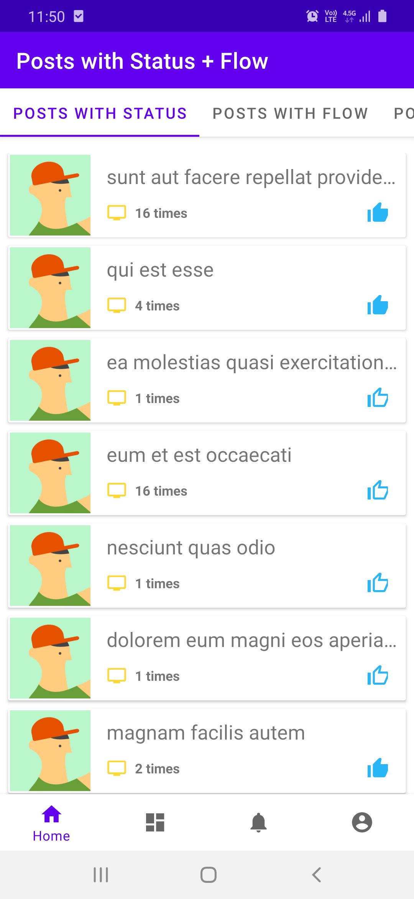
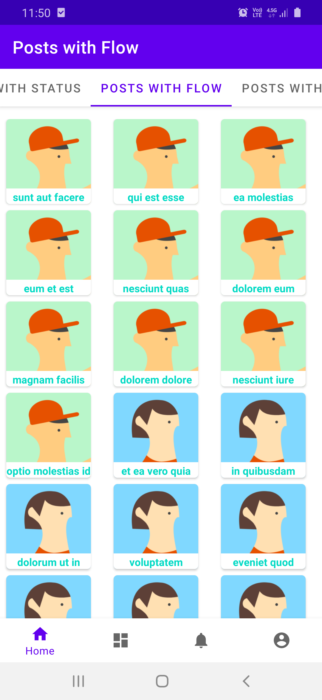
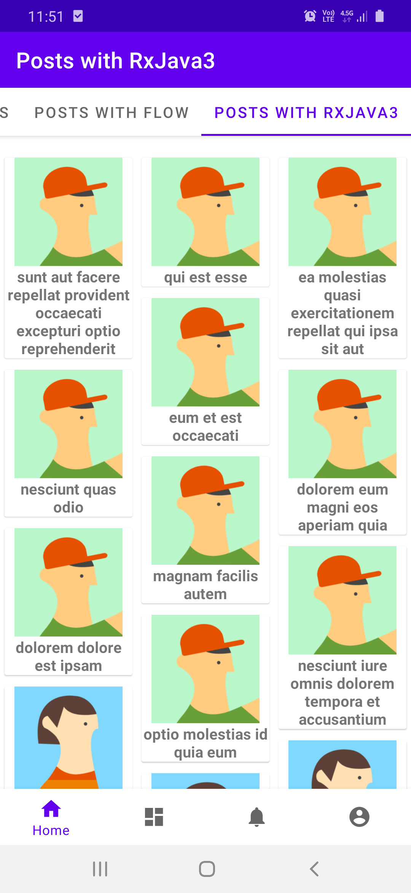
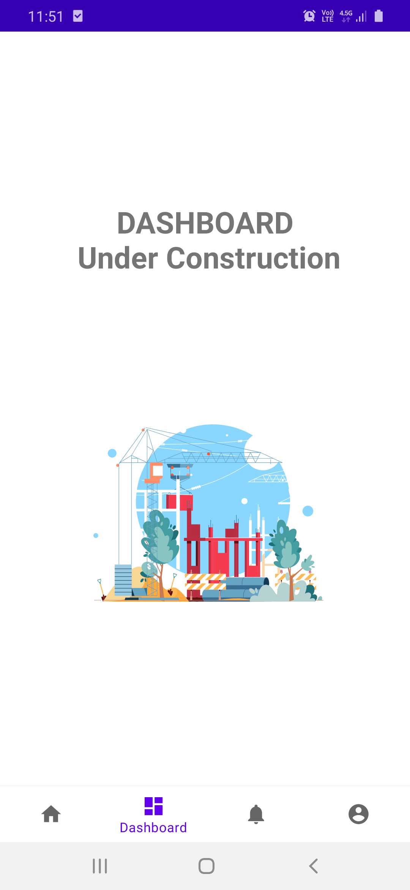

# MVVM Clean Architecture with RxJava3+Coroutines Flow, Static Code Analysis, Dagger Hilt, Dynamic Features

[](https://ktlint.github.io/)
[](https://kotlinlang.org)
[](https://android-arsenal.com/api?level=21)


Sample project that build with MVVM clean architure and various cool tech stack including RxJava3 and Coroutines Flow, Dynamic Feature modules as base of BottomNavigationView or ViewPager2, with both OfflineFirst and OfflineLast approaches as database Single Source of Truth

| Posts with Stautus        | Flow   | RxJava3  | Dashboard
| ------------------|-------------| -----|--------------|
|  |  |  | |


### Overview
* Gradle Kotlin DSL is used for setting up gradle files with ```buildSrc``` folder and extensions.
* KtLint, Detekt, and Git Hooks is used for checking, and formatting code and validating code before commits.
* Dagger Hilt, Dynamic Feature Modules with Navigation Components, ViewModel, Retrofit, Room, RxJava, Coroutines libraries adn dependencies are set up.
* ```features``` and ```libraries``` folders are used to include android libraries and dynamic feature modules
* In core module dagger hilt dependencies and ```@EntryPoint``` is created
* Data module uses Retrofit and Room to provide Local and Remote data sources
* Repository provides offline and remote fetch function with mapping and local save, delete and fetch functions

